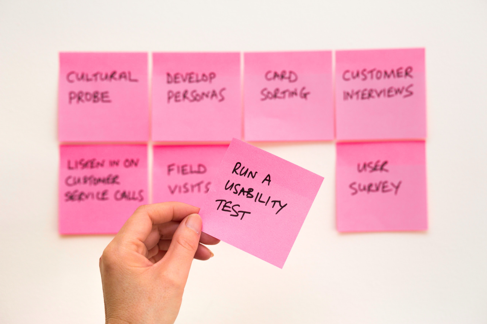

When Macmillan Learning reorganized the digital product organization, I jumped at the opportunity to co-create an improved workflow for researching, designing, implementing, and shipping digital learning products.

## Task ##

My responsibility was to represent the design team and end user’s needs in a new workflow for researching, designing, implementing, and shipping digital learning products. I co-created this workflow with our ProductOps leader.

## Actions ##

To determine what changes would provide the greatest impact, I proposed the following process to my counterpart in ProductOps.

1. **Listen:** Research the joys and pains that team members are feeling as they collaborate across disciplines
2. **Align:** Gather our findings, create metrics to validate we've accomplished the goal
3. **Test:** Prototype solutions and evaluate them against the metrics
4. **Rally:** Review the proven intervention and implement it across the team

### Understand the teams (Listen) ###

Given our design team's focus on participatory decision making and co-creation, I decided to gather information from individual members of the design team, not only the design managers. Design managers agreed this gave me more complete information and gave a jump start establishing buy-in from the team on the new process. I conducted a workshop with the full design team to identify strong points and opportunities to improve in our collaboration with Product.

In order to move quickly, I agreed with the ProductOps lead to focus discovery efforts within our respective teams, drawing on existing relationships and norms within the teams.

### Discover shared objectives (Align) ###

#### Opportunities to improve ####

Design most wanted to improve in these areas:

- Understand the criteria for making decisions about what user needs and features to prioritize
- Prioritize improvements to the user experience currently considered out of scope

Product hoped to improve:

- Maintain forward momentum on prioritized work
- Keep the schedule predictable

#### Aligning identified needs ####

I determined that the teams' requests centered on:

- _Align_ on decision criteria
- _Align_ on decisions made over the course of the initiative.
- _Create predictability_ in time required to conduct research and execute design tasks
- _Execute_ the aligned decisions to schedule
- _Prioritize_ items not currently in scope for later execution

Reviewing these needs with my counterpart in Product, we agreed to address these requests by adjusting checkpoints the product development workflow.

1. Teams align on the goals and intended outcomes for an initiative from the start by co-creating OKRs for the initiative.
2. Use the OKRs to guide decision making over the course of the initiative.
3. Commit to executing team decisions based in the OKRs, even if individuals disagree.
4. Prioritize and schedule improvements to the user experience identified over the course of the initiative but considered out of short term scope.

> **Adjust this to focus on the metrics used to evaluate the system.**
>
> - Team members report feeling aligned on goals and intended outcomes for the initiative
> - Team members align on and support decisions
> - Teams make decisions and act on them in a timely manner

### Experiment for fit (Test) ###

- High level framework
  - Includes checkpoints for planning research, design execution,
- Low level framework - created based on input from Design: codify methods
  - Includes "plays" for research, design, decision making methods to use

### Scoring our success ###

- Approved by Design and Product leadership comparing against the success metrics
- Approved by Design team members
- Enacted

Evaluated full-team implementation via recurring survey where team members anonymously report against the key metrics.

- Repeat the key metrics questions

## Result ##

Product and Design teams reported

- Decreased feeling of churn [Word this more positively]
- Increased feeling of alignment on criteria for decisions and when making decisions over the course of the initiative
- Increased sense of forward progress -- better predictability

> "Pain points" for reference in results section
>
> - _Align_ on decision criteria
> - _Align_ on decisions made over the course of the initiative.
> - _Create predictability_ in time required to conduct research and execute design tasks
> - _Execute_ the aligned decisions to schedule
> - _Prioritize_ items not currently in scope for later execution
